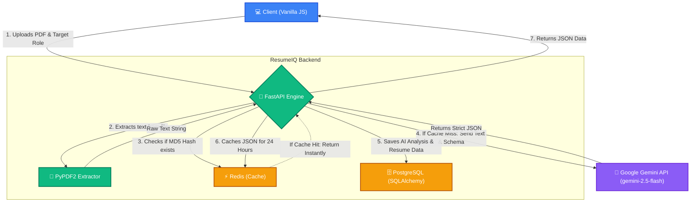

# ResumeIQ — AI Resume Analyzer 🚀

ResumeIQ is an open-source, production-grade SaaS pipeline engineered to dismantle the ambiguity behind corporate Applicant Tracking Systems (ATS). By inspecting your unstructured PDF profiles against variable job specifications, ResumeIQ delivers deep algorithmic compatibility grading, metric-driven statement diagnostics, and real-time semantic caching.

---

## 📦 What It Does
* **Automated Heuristic Evaluation:** Instantly evaluates engineering records to spit back explicit keyword matrices and core compatibility indexing percentages.
* **Deterministic Structured Extraction:** Guarantees structural output parsing directly out of deep contextual models via native Pydantic enforcement layers.
* **Granular Context-Aware Corrections:** Pinpoints non-quantifiable experience descriptors and programmatically outputs optimized, impact-driven rewrites.

---

## 🛠️ Deep Tech Stack
* **Frontend Runtime:** Pure Vanilla Static Architecture (ES6 JavaScript / Custom Flex-Grid CSS3 Engine) hosted over global Edge Networks on **Vercel CDN**.
* **API Microservice:** Asynchronous **FastAPI (Python 3.11+)** contextually isolated on **Render**.
* **Relational Storage:** Serverless transactional **PostgreSQL** provisioned over compute-decoupled architectures on **Neon Database**.
* **Caching & Performance Optimization:** Low-latency storage instance utilizing **Upstash Redis** for real-time query deduplication and 24-hour TTL invalidation.
* **Upstream Inference Engine:** Modern structural generation utilizing the official **Google GenAI SDK** targeting **Gemini 2.5 Flash**.

---

## 🚀 Live Environment Access
* **Application URL:** [https://ats-resume-checker-gamma.vercel.app](https://ats-resume-checker-gamma.vercel.app)
* **Interactive API Playground:** [https://ats-resume-checker-00jy.onrender.com/docs](https://ats-resume-checker-00jy.onrender.com/docs)

---

## 📊 Infrastructure Architecture Flow



---

## 🛠️ Local Development

### Prerequisites

Before getting started, make sure you have:

- Python 3.11+
- A Google Gemini API Key
- Upstash Redis Database URL
- Neon PostgreSQL Database URL

---

### 1️⃣ Clone the Repository

```bash
git clone https://github.com/Faizan-Khan0007/ats-resume-checker.git
cd ats-resume-checker
```

---

### 2️⃣ Create and Activate a Virtual Environment

```bash
python -m venv venv
```

**Windows**

```bash
venv\Scripts\activate
```

**Mac/Linux**

```bash
source venv/bin/activate
```

---

### 3️⃣ Install Dependencies

```bash
pip install -r requirements.txt
```

---

### 4️⃣ Configure Environment Variables

Create a `.env` file in the project root directory and add the following:

```env
DATABASE_URL=your_neon_postgres_url
REDIS_URL=your_upstash_redis_url
GEMINI_API_KEY=your_gemini_api_key
```

---

### 5️⃣ Start the Development Server

```bash
uvicorn main:app --reload
```

---

### 6️⃣ Open the Application

Once the server is running:

- **API Base URL:** `http://localhost:8000`
- **Swagger Documentation:** `http://localhost:8000/docs`

---

✅ The FastAPI backend is now running locally and ready for development.
